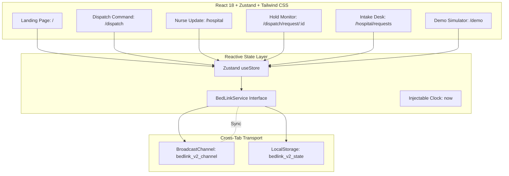

# BedLink

> **TechForge 2026 Submission**  
> **Team**: Bug Dealers  
> **Domain**: HealthTech  
> **Live Production Deployment**: [https://bug-dealers-bed-link-gamma.vercel.app](https://bug-dealers-bed-link-gamma.vercel.app)  

---

## Project Overview

BedLink is a real-time emergency hospital-bed coordination platform that automates multi-factor hospital discovery, physical bed reservation holds, and dynamic fallback re-ranking for ambulances in transit. By combining hard medical capability matching, Haversine travel time estimation, hospital load balancing, and bed telemetry freshness scoring, BedLink guarantees that ambulances route exclusively to hospitals equipped and committed to receive their patients.

---

## Problem Statement

In emergency medical services (EMS), ambulances frequently transport critical patients to hospitals with zero guarantee of an available matching bed or specialized capability (such as an ICU bed with a ventilator and medical oxygen). Emergency departments face severe operational bottlenecks, verbal phone-based bed inquiries lead to stale or conflicting availability information, and ambulances are diverted while in transit—costing precious minutes in time-critical emergencies.

BedLink addresses this by providing an authoritative, automated hospital ranking and reservation engine that transactionally locks a physical bed under a time-bound hold, allows the target hospital to accept or decline the offer, and instantly re-ranks and offers the next optimal facility if an offer expires or is declined.

---

## Key Features

### Implemented
- **Deterministic Multi-Factor Hospital Ranking**: Ranks candidate hospitals using an explicit evaluation timestamp based on Travel Time (ETA), Bed Data Freshness, and Hospital Load Penalty.
- **Hard Capability Gate**: Strictly enforces that hospitals must have an available physical bed satisfying all requested medical capabilities (`general`, `oxygen`, `icu`, `ventilator`).
- **Domain Decoupling (`BedRequest` vs `Reservation`)**: Separates the overall emergency workflow aggregate (`BedRequest`) from individual hospital offer attempts (`Reservation`).
- **Atomic Physical-Bed Reservation Holds**: Database-level PL/pgSQL stored procedures lock physical beds transactionally, preventing double-booking across concurrent requests.
- **Authoritative 120-Second Hold Expiry**: Time-bound holds expire based on authoritative server/database clocks rather than client-side timers.
- **Dynamic Fallback Re-Ranking**: If a reservation is rejected or expires, BedLink excludes previously attempted facilities and dynamically re-ranks the current database state (`old rank + 1` is strictly forbidden).
- **Physical Bed Invariant (`ACCEPTED != OCCUPIED`)**: Hospital acceptance confirms receipt of an incoming patient while keeping the bed in `held` status until clinical admission.
- **Defense-in-Depth Authentication & RBAC**: Strict four-role authorization (`nurse`, `dispatch`, `hospital`, `admin`) enforced across Next.js Edge Middleware, Server Operations, and PostgreSQL Row-Level Security (RLS).
- **Authenticated Server Operation Boundary**: Typed server operations exposing Nurse (inventory management), Dispatch (request creation and tracking), and Hospital (offer review, accept, reject) workflows.
- **Nurse Inventory Interface (`/nurse`)**: Operational bed management UI allowing hospital nurses to view departmental beds, update statuses, and monitor telemetry freshness.
- **Dispatch Operational Interface (`/dispatch`)**: End-to-end EMS dispatch console for emergency bed request creation, multi-factor ranked hospital visualization, single-hold offer monitoring, countdown timers, and fallback progression tracking.
- **Hospital Operational Interface (`/hospital`)**: Dedicated response console for hospital operations desks to review incoming emergency bed reservation holds, examine patient clinical requirements and ETA, and execute authoritative Accept or Reject decisions within the 120-second hold window.
- **Supabase Realtime Synchronization**: Role-scoped WebSocket push synchronization across Nurse, Dispatch, and Hospital operational interfaces with debounced server invalidation, connection lifecycle management, and reconnect resync.

### Planned / Future Scope
- **Phase 11: QA / Demo Hardening**: End-to-end multi-client browser demonstration scenarios.
- **Phase 12: Production Deployment**: Hosted infrastructure orchestration and cloud telemetry.
- **GPS Telemetry**: Live ambulance GPS telemetry and dynamic ETA re-computation.
- **Clinical Admission**: Post-arrival workflows transitioning beds from `held` to `occupied`.

---

## System Architecture



### State Machine Lifecycle
```text
                     +---------------------------------------+
                     |         Ambulance in Transit          |
                     |  (Capabilities, Origin GPS Location)  |
                     +---------------------------------------+
                                         |
                                         v
                     +---------------------------------------+
                     |           DISPATCH CREATES            |
                     |              BedRequest               |
                     +---------------------------------------+
                                         |
                                         v
                     +---------------------------------------+
                     |         PHASE 4 RANKING ENGINE        |
                     |  - Binary Medical Capability Gate     |
                     |  - Haversine Travel Component (0..60) |
                     |  - Data Freshness Component (0..30)   |
                     |  - Current Load Penalty (-50..0)      |
                     |  - Deterministic Multi-Tier Tie Break |
                     +---------------------------------------+
                                         |
                                         v
                     +---------------------------------------+
                     |      RESERVATION ATTEMPT #1 (HELD)     |
                     |  - Locks physical bed in PostgreSQL   |
                     |  - 120-second authoritative expiry    |
                     +---------------------------------------+
                                    /         \
                       Hospital Accepts     Hospital Rejects or Expiry
                              /                 \
                             v                   v
             +-----------------------+   +------------------------------------+
             |   STATUS: ACCEPTED    |   | Bed released to 'available'        |
             | - Bed remains HELD    |   | Hospital logged in attempted list  |
             | - Ambulance en route  |   | Dynamic Fallback Re-ranking (#N+1) |
             +-----------------------+   +------------------------------------+
```

### Domain Data Model
1. **`hospitals`**: Facility metadata, geographic coordinates, operational status (`operational`, `emergency`, `offline`), and current load percentage.
2. **`profiles`**: Application user identity, role (`nurse`, `dispatch`, `hospital`, `admin`), and strict hospital affiliation constraints.
3. **`beds`**: Physical bed inventory, assigned capabilities array, room number, operational status (`available`, `held`, `occupied`, `maintenance`), and update timestamps.
4. **`bed_requests`**: EMS workflow aggregate containing patient required capabilities, ambulance coordinates, status, and attempted hospital tracking array.
5. **`reservations`**: Individual time-bound offer attempts linking a `BedRequest` to a specific `Hospital` and `Bed`.

---

## Actors & Role-Based Permissions

BedLink provides five purpose-built actor interfaces rather than a single shared dashboard with hidden buttons:

| Actor Role | Dedicated Route | Form Factor / Shell | Core Permissions | Escalation Fallback |
| :--- | :--- | :--- | :--- | :--- |
| **Ward Nurse** | `/nurse` | Phone (Field Shell) | Update own hospital bed counts & ED load, confirm up to date, view recent updates | Receives incoming bed hold alert only if ED Coordinator is offline |
| **ED Coordinator** | `/desk` | Tablet / Desktop (Console Shell) | Accept/reject incoming bed requests within 2 min, manage active holds, mark patient arrived, edit own beds | Primary responder for all incoming hospital hold offers |
| **Dispatcher** | `/dispatch` | Desktop (Console Shell) | Multi-ambulance placement, filter/sort regional hospitals (read-only), skip/cancel requests, inspect attempt timelines | Can intervene across any in-flight request |
| **Ambulance Crew** | `/crew` | Phone / Rugged Tablet (Field Shell) | 30-second need-to-hold protocol, GPS auto-lock, glove-friendly 72px buttons, top 3 options, turn-by-turn navigation link upon hold | Can request bed, cancel with undo, mark arrived |
| **Network Admin** | `/admin` | Desktop (Console Shell) | Manage hospital capacities, manage users and roles, adjust ranking weights with live re-ranking preview, view audit log | System administrator |

Permissions are enforced twice: through client-side route guards and in the `BedLinkService` layer with typed error handling and audit logging.

---

## Demonstration Credentials

All accounts can be authenticated at `/login` or selected with 1-tap from the "Demonstration Accounts" drawer on the login page:

| Role | Username / Identity | Credential | Target Scope |
| :--- | :--- | :--- | :--- |
| **Ward Nurse** | City General Hospital | PIN: `2468` | Ward Bed Terminal |
| **ED Coordinator** | City General Hospital | PIN: `1357` | ED Intake Console |
| **Ambulance Crew** | Unit `AMB-214` | PIN: `1357` | Paramedic Field Terminal |
| **Ambulance Dispatcher** | `dispatch@bedlink.demo` | Password: `demo1234` | Ambulance Control Room |
| **Network Admin** | `admin@bedlink.demo` | Password: `demo1234` | System Configuration |

*Note: In addition to City General Hospital, every other hospital in the regional network has seed Nurse and ED Coordinator accounts with identical PINs.*

---

## Ranking Engine & Mathematical Model

The ranking function (`src/lib/ranking.ts`) evaluates each facility and outputs a score from 0 to 100:

$$\text{Score} = (W_{\text{ETA}} \times S_{\text{ETA}} + W_{\text{Bed}} \times S_{\text{Bed}} + W_{\text{Fresh}} \times S_{\text{Fresh}} + W_{\text{Load}} \times S_{\text{Load}}) \times 100$$

### Default Factor Weights
- Travel Time ($W_{\text{ETA}}$): 40% (shifted to 45% under Critical severity)
- Bed Availability ($W_{\text{Bed}}$): 25% (shifted to 20% under Critical severity)
- Verification Freshness ($W_{\text{Fresh}}$): 20%
- Emergency Department Load ($W_{\text{Load}}$): 15%

### Factor Definitions
1. **Travel Time ($S_{\text{ETA}}$)**: Linearly scales from 1.0 at 0 minutes to 0.0 at 30 minutes. Road travel times are estimated using Haversine distance with a 1.35 urban road winding factor, 38 km/h average speed, and a 1-minute dispatch overhead.
2. **Bed Capacity ($S_{\text{Bed}}$)**: The arithmetic mean of $\min(1.0, \frac{\text{Free}}{3})$ across all requested bed categories. Free capacity is strictly computed as $\text{Available} - \text{Held}$.
3. **Verification Freshness ($S_{\text{Fresh}}$)**:
   - $0 \le t \le 5\text{ min}$: 1.0 (Fresh)
   - $5 < t \le 60\text{ min}$: Linear decay from 1.0 to 0.2
   - $t > 60\text{ min}$: Gradual decay to a 0.1 floor. Listings older than 45 minutes mandate direct telephone verification.
4. **Emergency Load ($S_{\text{Load}}$)**: Low load = 1.0, Moderate load = 0.5, High/Surge load = 0.0.

---

## Technology Stack

| Layer | Technology | Purpose |
| :--- | :--- | :--- |
| **Frontend Framework** | React 19 / Vite | Fast responsive client application |
| **Server Runtime** | Next.js 15 (Edge & Node.js) | Server operations and API routing |
| **State Management** | Zustand | Client state and reactive cross-tab sync |
| **Styling** | Tailwind CSS / CSS Variables | Clinical design system and WCAG AAA compliance |
| **Database** | PostgreSQL / Supabase | Authoritative relational persistence, transactions, and RLS |
| **Auth & Security** | Supabase Auth & PostgreSQL RLS | Identity management and database-level isolation |
| **Test Engine** | PGlite (`@electric-sql/pglite`) & Vitest | Zero-dependency embedded PostgreSQL and unit testing |
| **Scripting / Runner** | TSX (`tsx`) | High-speed TypeScript test and migration execution |

---

## Setup & Installation

### Prerequisites
- Node.js 18.18+ or 20+
- npm 9+

### Installation Steps

1. **Clone the repository**:
   ```bash
   git clone https://github.com/AkkiSensei/BugDealers-BedLink.git
   cd BugDealers-BedLink
   ```

2. **Install dependencies**:
   ```bash
   npm install
   ```

3. **Start the development server**:
   ```bash
   npm run dev
   ```

4. **Verify the complete implementation**:
   ```bash
   npm run test:db
   npm run test:auth
   npm run test:ranking
   npm run test:reservations
   npm run test:operations
   ```

5. **Verify production compilation**:
   ```bash
   npm run build
   ```

---

## Running Tests

BedLink features a comprehensive test suite covering every layer of the architecture:

```bash
# 1. Pure Ranking & State Machine Unit Tests
npm test

# 2. Database Foundation & RLS Policies (31 tests)
npm run test:db

# 3. Authentication, Identity & RBAC Matrix (29 tests)
npm run test:auth

# 4. Deterministic Hospital Ranking Engine (64 tests)
npm run test:ranking

# 5. Atomic Reservations, Concurrency & Fallback Engine (77 tests)
npm run test:reservations

# 6. Authenticated Server Operations Layer (51 tests)
npm run test:operations

# 7. Database SECURITY DEFINER Audit & Hardening (10 tests)
npm run test:security

# 8. Nurse Operational Interface (25 tests)
npm run test:nurse

# 9. Dispatch Operational Interface (41 tests)
npm run test:dispatch

# 10. Hospital Operational Interface (38 tests)
npm run test:hospital

# 11. Supabase Realtime Live Subscriptions (42 tests)
npm run test:realtime

# 12. Development State Reset Verification
npm run db:reset
```

### Verification Suite Breakdown

| Suite | File | Assertions | Core Validations |
| :--- | :--- | :---: | :--- |
| **Database** | `scripts/verify-db.ts` | 31 | Schema structure, partial unique indexes, capability check constraints, deterministic seed, RLS isolation. |
| **Auth & RBAC** | `scripts/verify-auth.ts` | 29 | Profile resolution, role isolation, organizational boundaries, dispatch ownership, admin privileges. |
| **Ranking** | `scripts/verify-ranking.ts` | 64 | Multi-factor arithmetic, binary bed matching gate, freshness tiers, load penalties, 5-tier deterministic tie-breaking. |
| **Reservations** | `scripts/verify-reservations.ts` | 77 | Transactional holds, hold duration, accept/reject state transitions, dynamic fallback, race conditions, bed invariants. |
| **Operations** | `scripts/verify-operations.ts` | 51 | Nurse bed updates, dispatch request creation, hospital accept/reject, input validation, role matrix enforcement. |
| **Security** | `scripts/verify-security.ts` | 10 | Explicit search_path hardening, SECURITY DEFINER privilege escalation defense, function security audit. |
| **Nurse UI** | `scripts/verify-nurse-ui.ts` | 25 | Hospital inventory display, role protection, bed status updates, freshness badges, organization boundaries. |
| **Dispatch UI** | `scripts/verify-dispatch-ui.ts` | 41 | Route RBAC, request creation, server validations, ranking display, single-hold invariant, fallback progression. |
| **Hospital UI** | `scripts/verify-hospital-ui.ts` | 38 | Response console, ownership isolation, accept/reject workflows, ACCEPTED != OCCUPIED invariant, fallback trigger, expired hold defense. |
| **Realtime** | `scripts/verify-realtime.ts` | 42 | Role-scoped channels, boundary filtering, reconnect resync, coalescing debounce, E2E PostgreSQL workflow. |
| **Total** | | **408** | **100% Passing** |

---

## Design System & Accessibility

BedLink follows a strict clinical design system:
- **Zero Emojis**: Communication is driven strictly by typography and Lucide vector icons (at 1.75 stroke width).
- **Tabular Figures**: Every numeric figure, bed count, and countdown timer uses `font-variant-numeric: tabular-nums` to prevent layout shift during live ticks.
- **Color Discipline**: Muted slate surfaces (`#F6F8FB` light, `#0A1220` dark) with primary clinical blue (`#1859D6`). Red (`#C62B2B`) and amber (`#B7600B`) are reserved exclusively for active emergency risks (stale data, full unit, timeout).
- **Touch Targets**: 72px buttons for nurse bed steppers; 56px minimum heights for dispatch controls.
- **High-Contrast Mode**: Dedicated toggle in the settings menu that raises contrast ratios to meet WCAG AAA standards.

---

## Reference Repositories & Licences

BedLink adapts patterns and architectural craft from industry-standard open-source repositories under MIT and Apache-2.0 licences. Full attribution and notices are documented in `THIRD_PARTY_NOTICES.md`:

| Project / Repository | Licence | Architectural Influence in BedLink |
| :--- | :--- | :--- |
| `satnaing/shadcn-admin` | MIT | Console app shell, floating top bar, narrow collapsible rail, command palette, and settings store. |
| `shadcn-ui/ui` | MIT | Radix primitives, login-02 split pattern, floating/inset sidebar geometry, and table design tokens. |
| `Kiranism/next-shadcn-dashboard-starter` | MIT | Role-based navigation patterns (RBAC nav config per role) and breadcrumb synchronization. |
| `tremorlabs/tremor` | Apache-2.0 | KPI metrics cards, progress indicators, and compact freshness tracker strips. *(Implemented from scratch without installing `@tremor/react`)*. |
| `emilkowalski/vaul` & `sonner` | MIT | Mobile drawers with tactile drag handles, interactive undo toast patterns. |
| `traccar/traccar-web` | Apache-2.0 | Boxed map layout semantics and active vehicle / ambulance request tracking board. |
| `openmrs-esm-patient-management` | Study-Only | Calm clinical tone, non-alarming status tags, and dense hospital patient queues. *(Zero code copied)*. |
| `DISHANTUS/MESHCUE` | Study-Only | Multi-factor explainable dispatch ranking breakdown ("Why this rank?") and scenario simulation controls. *(Zero code copied)*. |

---

## Production Backend Integration Guide

To replace the included `MockBedLinkService` with a live production backend, implement the `BedLinkService` interface:

```typescript
export interface BedLinkService {
  getHospitals(): Hospital[];
  getHospitalState(id: string): HospitalState | undefined;
  getAllHospitalStates(): Record<string, HospitalState>;
  getRequests(): Record<string, BedRequest>;
  updateBeds(id: string, beds: Record<BedType, number>): void;
  updateLoad(id: string, load: LoadStatus): void;
  confirmUpToDate(id: string): void;
  createRequest(request: Omit<BedRequest, 'id' | 'status' | 'createdAt' | 'timeline'>): string;
  cancelRequest(id: string): void;
  respondToRequest(id: string, hospitalId: string, accept: boolean, reason?: string): { success: boolean; reason?: string };
  releaseHold(id: string, hospitalId: string): void;
  completeRequest(id: string, hospitalId: string): void;
  subscribe(callback: () => void): () => void;
}
```

Recommended production backend stack:
- **Database**: PostgreSQL with row-level locking (`SELECT ... FOR UPDATE`) or Supabase with pg_cron for automatic hold expiry.
- **Transport**: WebSockets or Server-Sent Events (SSE) for millisecond-latency push notifications to dispatch consoles.
- **Routing**: Open Source Routing Machine (OSRM) or Google Maps Distance Matrix API replacing the Haversine mock provider.

---

## Demonstration Mode

Visit `/demo` to test scenarios:
- **Accelerated Timeouts**: Compress the 2-minute clinical hold window to 10 seconds.
- **Fast-Forward Clock**: Advance time by 15 or 45 minutes to observe data degradation and phone verification triggers.
- **Concurrent Contention (Race Test)**: Spawn competing requests to verify atomic rejection ("That bed was just taken") and immediate automatic cascading.
- **Live Event Log**: Inspect all synchronized actions across active browser windows.

---

## Security & Environment Configuration

- **Zero Tracked Secrets**: BedLink commits no private keys, passwords, or `.env` files.
- **PostgreSQL Row-Level Security (RLS)**: Data access boundaries are enforced directly in the database engine, ensuring that nurses cannot view other hospitals' inventories and dispatchers cannot inspect other dispatchers' requests.
- **Server Authority**: Critical operations derive caller identity strictly from authenticated sessions and server-side profile lookups, never trusting client-supplied parameters.
- **Safe Error Handling**: Internal database exceptions and SQL query internals are sanitized before returning responses to callers.

---

## Vercel Production Deployment

- **Live URL**: [https://bug-dealers-bed-link-gamma.vercel.app](https://bug-dealers-bed-link-gamma.vercel.app)
- **Deployment Status**: `READY` (Production)
- **Project Name**: `bug-dealers-bed-link`
- **Framework Preset**: **Vite**
- **Build Command**: `npm run build` (`tsc && vite build`)
- **Output Directory**: `dist`
- **SPA Routing**: Preconfigured via `vercel.json` rewrite:
```json
{
  "rewrites": [
    {
      "source": "/(.*)",
      "destination": "/index.html"
    }
  ]
}
```

---

## Team Members

**Team**: Bug Dealers  
- **Ritunjay**
- **Saanvi**
- **Sylborn**

---

## Regulatory Disclosures & Limitations

Demonstration data. Not a medical device. This software is designed as a workflow coordination and decision-support prototype. It does not replace clinical judgment, physician triage, or established county emergency medical protocols.
